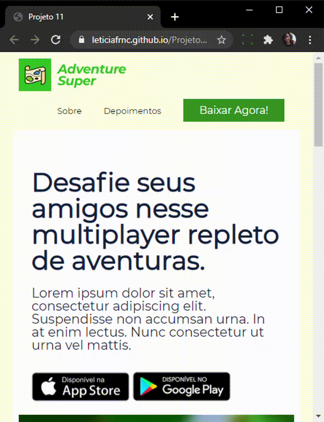
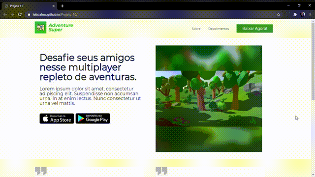

### Projeto_10

O Projeto_10 foi desenvolvido para treinar minhas habilidades em HTML e CSS. É uma página para divulgação de jogos.

### Características
Esta Landing Page exibe uma maneira de mostrar seu trabalho.
- Funciona em todos os tipos de telas.
- HTML
- CSS

### Instalação 

Clone este repositório usando git clone https://github.com/Leticiafrnc/Projeto_10.git ou clique em Code/Download ZIP.
Clique no arquivo "index.HTML" e veja a aplicação.

### Observação: Se abrir a aplicação no celular, tablet ou qualquer tipo de tela a aplicação se adapta.
